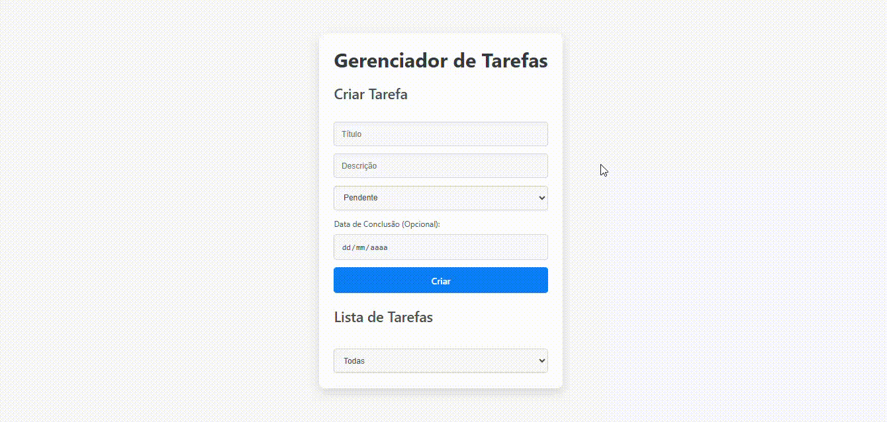

Gerenciador de Tarefas desenvolvida em React

## Tecnologias Usadas
React

Vite

## Screenshot

## Clone o repositório
git clone https://github.com/gimidia/task-manager-frontend

cd task-manager-frontend

## Instale as dependências:
npm install

## Para iniciar a aplicação, execute:
npm run dev
